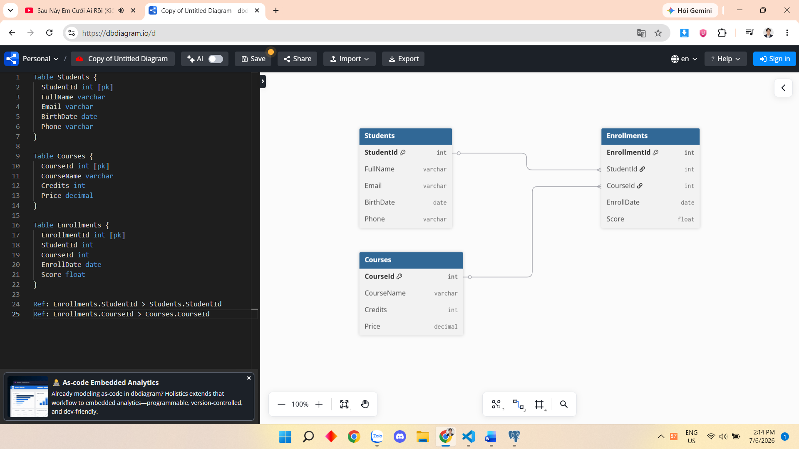

* **Category 1 → N Product:** Một danh mục có nhiều sản phẩm.
* **Supplier 1 → N Product:** Một nhà cung cấp có thể cung cấp nhiều sản phẩm.
* **Product** là bảng trung tâm, liên kết với **Category** và **Supplier** thông qua hai khóa ngoại `CategoryId` và `SupplierId`. Điều này giúp quản lý sản phẩm theo danh mục và nhà cung cấp một cách rõ ràng, tránh trùng lặp dữ liệu.

Mục đích của khóa ngoại là:

* **Đảm bảo tính toàn vẹn dữ liệu:** Chỉ cho phép lưu những giá trị đã tồn tại ở bảng được tham chiếu.
* **Liên kết dữ liệu giữa các bảng:** Giúp các bảng có mối quan hệ với nhau thay vì lưu trùng lặp dữ liệu.
* **Ngăn dữ liệu không hợp lệ:** Ví dụ, không thể đăng ký một môn học cho sinh viên không tồn tại.
* **Hỗ trợ truy vấn:** Dễ dàng kết hợp dữ liệu từ nhiều bảng bằng `JOIN`.

