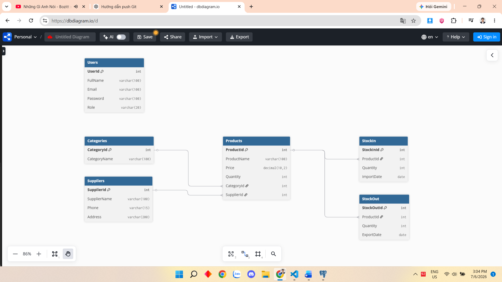

# Database Practice

## Giới thiệu

Đây là bài thực hành về thiết kế cơ sở dữ liệu quản lý kho bằng PostgreSQL.

Dự án gồm các bảng:

* Users
* Categories
* Suppliers
* Products
* StockIn
* StockOut

Ngoài ra còn có các câu query để tìm kiếm, thống kê và quản lý dữ liệu.

## Cấu trúc project

* `01_create_tables.sql`: Tạo các bảng.
* `02_seed_data.sql`: Thêm dữ liệu mẫu.
* `03_queries.sql`: Chứa 20 câu query.

## Cách chạy

Bước 1: Tạo một database mới trong PostgreSQL.

Bước 2: Chạy file `01_create_tables.sql` để tạo các bảng.

Bước 3: Chạy file `02_seed_data.sql` để thêm dữ liệu mẫu.

Bước 4: Chạy file `03_queries.sql` để thực hiện các câu truy vấn.

## Nội dung đã thực hiện

* Tạo bảng và khóa ngoại.
* Thêm dữ liệu mẫu.
* Thực hiện các câu lệnh SELECT.
* JOIN nhiều bảng.
* Thống kê bằng COUNT, SUM và AVG.
* Quản lý nhập kho và xuất kho.

## ERD

File `ERD.png` mô tả mối quan hệ giữa các bảng trong cơ sở dữ liệu

